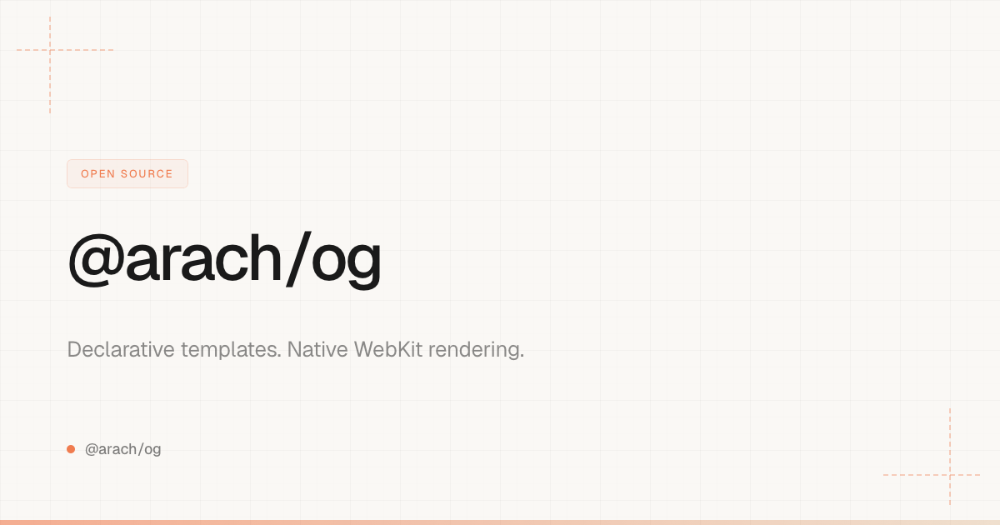
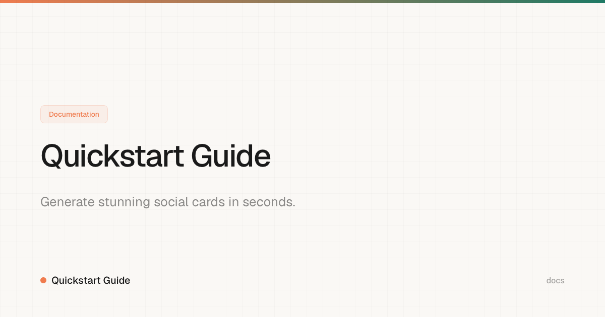
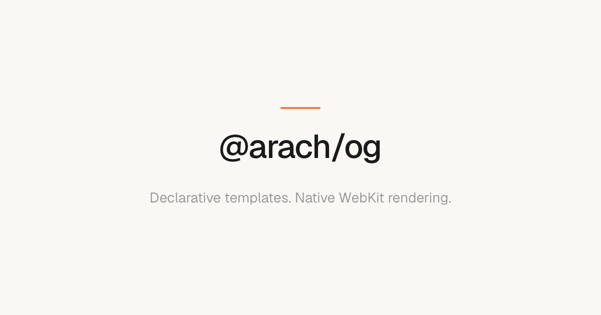
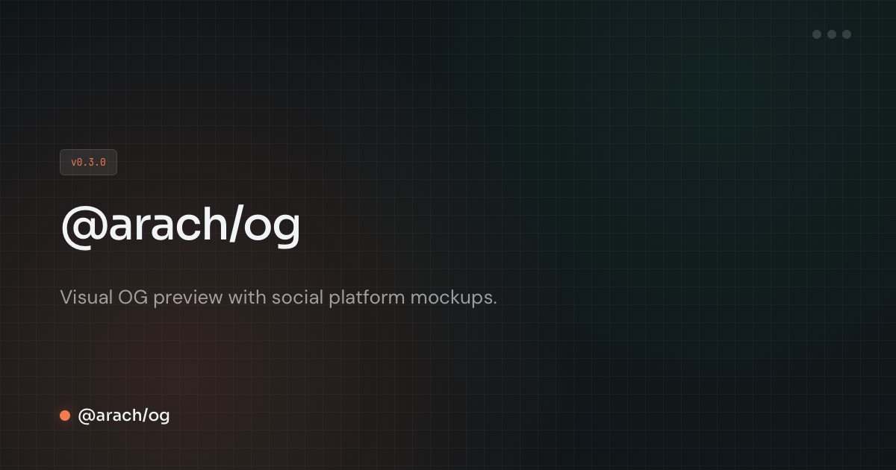

# @arach/og

Declarative OG (Open Graph) image generation with native WebKit rendering. Pre-built templates and a simple API for generating social sharing images.

## Why not Puppeteer?

Most OG tools pull in a headless browser — Puppeteer, Playwright, or a bundled Chromium — plus font files as npm dependencies to get typography right.

`@arach/og` takes a different path: templates are plain HTML, fonts load from Google Fonts or CDN at render time, and a small native renderer (`og-render`) snapshots them through macOS WebKit. No Puppeteer or Chromium in npm — but you do build and run our mini browser once on macOS.

| | Puppeteer / Playwright | `@arach/og` |
|---|---|---|
| npm browser dep | Bundled Chromium (~300MB) | None |
| Renderer | Downloaded Chromium | `og-render` → system WebKit |
| Fonts | npm packages or manual embed | Google Fonts / CDN at render |
| CSS | Full | Full |
| PNG export | macOS, Linux, CI | macOS (`og-render` required) |

## Installation

```bash
bun add @arach/og
og version   # check @arach/og + bundled og-render versions
og build     # macOS — rebuild og-render (skipped if a bundled binary matches your arch)
```

`og-render` ships as a **prebuilt binary** for your Mac arch (`native/og-render/bin/darwin-arm64/` or `darwin-x64/`), plus Swift source if you need to rebuild. It's a headless WKWebView snapshotter, not a Chromium download. PNG export uses the bundled binary by default; `og build` refreshes it from source.

**Signed releases** (Developer ID + Apple notarization) are published on GitHub:

```bash
# https://github.com/arach/og/releases — e.g. og-render-v0.3.0
# og-render-v0.3.0-darwin-arm64.zip
# og-render-v0.3.0-darwin-x64.zip
```

To cut a release locally or in CI:

```bash
bun run release:native          # build, sign, notarize (macOS + certs)
# CI: push tag og-render-v0.3.0 (see .github/workflows/release-og-render.yml)
```

## Usage

### Programmatic API

```typescript
import { generateOG } from '@arach/og'

await generateOG({
  template: 'branded',
  title: 'My App',
  subtitle: 'Build amazing things',
  accent: '#f07c4f',
  output: 'public/og.png'
})
```

### CLI

```bash
# Generate from a config file
bunx @arach/og config.json
```

Config file format:

```json
[
  {
    "template": "branded",
    "title": "My App",
    "subtitle": "Build amazing things",
    "accent": "#f07c4f",
    "output": "public/og.png"
  }
]
```

## Templates

### `branded`
Full-featured template with logo, tag chip, and accent glow. Great for product landing pages.



### `docs`
Clean template for documentation pages with breadcrumb-style layout.



### `minimal`
Simple centered layout. Works well for blog posts and articles.



### `editor-dark`
Dark theme template for developer tools and code editors.



## Configuration Options

| Option | Type | Default | Description |
|--------|------|---------|-------------|
| `template` | `string` | `'branded'` | Template ID |
| `title` | `string` | required | Primary title |
| `subtitle` | `string` | - | Subtitle or description |
| `accent` | `string` | `'#6366f1'` | Brand/accent color (hex) |
| `accentSecondary` | `string` | - | Secondary accent color |
| `background` | `string` | `'#0a0a0a'` | Background color |
| `textColor` | `string` | `'#ffffff'` | Text color |
| `output` | `string` | required | Output file path |
| `width` | `number` | `1200` | Width in pixels |
| `height` | `number` | `630` | Height in pixels |
| `scale` | `number` | `2` | Device scale factor (retina) |
| `fonts` | `string[]` | `['Geist', 'Geist']` | Google Fonts spec or Geist (CDN) — loaded at render, no npm font packages |
| `logo` | `string` | - | Logo URL or base64 |
| `tag` | `string` | - | Tag/chip text |

## Batch Generation

Generate multiple images at once:

```typescript
import { generateOGBatch } from '@arach/og'

await generateOGBatch([
  { template: 'branded', title: 'Home', output: 'og-home.png' },
  { template: 'docs', title: 'Docs', output: 'og-docs.png' },
])
```

## Hudson / Atelier bundle

`@arach/og` exports a Hudson app bundle from `./catalog`:

```ts
import { ogBundle, ogWorkspaceEntry, ogApp } from '@arach/og/catalog'
```

The Preframe-style alias `catalogApp` is also exported, so a host can resolve it with `mod.catalogApp ?? mod.ogApp ?? mod.default`. The bundle includes the `HudsonApp`, intents, config/HTML ports, a workspace registration entry, and a note describing assets/toolsets.

## License

MIT
